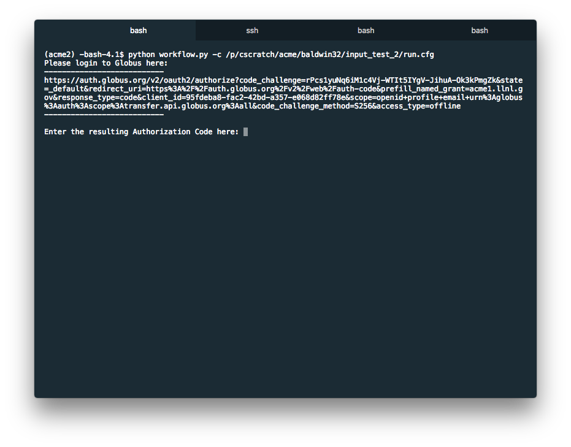
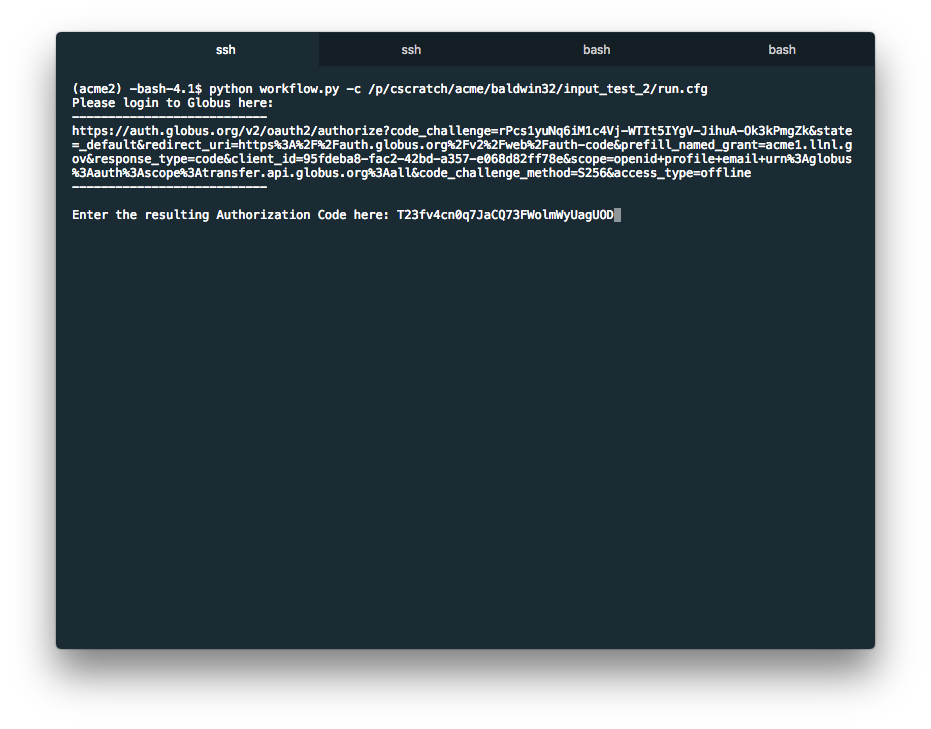
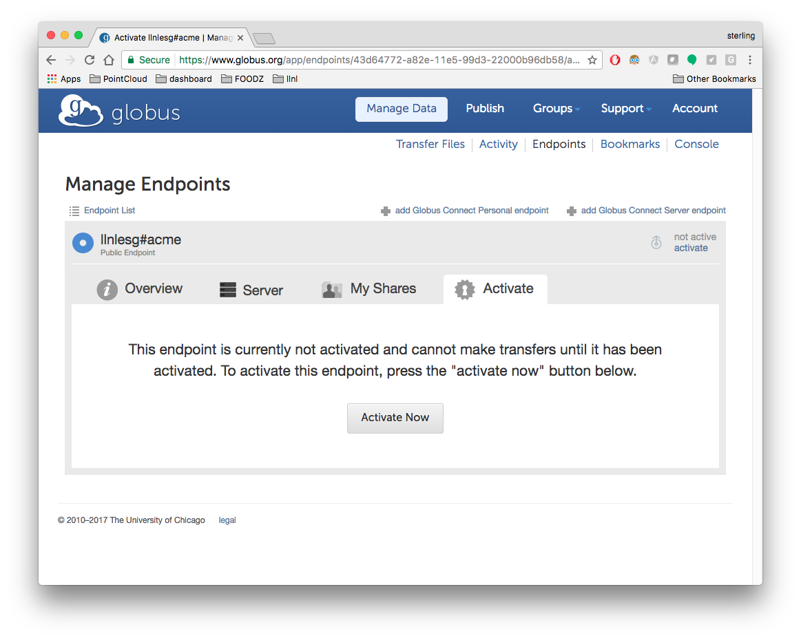

# Globus Authentication Walkthrough

### Globus authentication

When you start a new run, the first thing you will see is a link provided by the globus interface to authenicate your credentials.

Simply copy the address and paste into your browser. You will be presented with a page to choose which OAuth provided to use, its recommended that you use the default globus ID provider.

Once you have entered your credentials and logged in, you will be given a randomly generated key, copy that key and paste it into the terminal prompt

### Node activation

Once you have logged into globus, each data node will need to be activated with your account. This activation can last for days, but periodically needs to be re run. If the node needs to be activated you will be prompted, if your credentials are still cached on the node this step will be skipped.

Copy the link given and paste into a browser, then hit "Activate" and use your credentials for the target machine to log into that machine.

